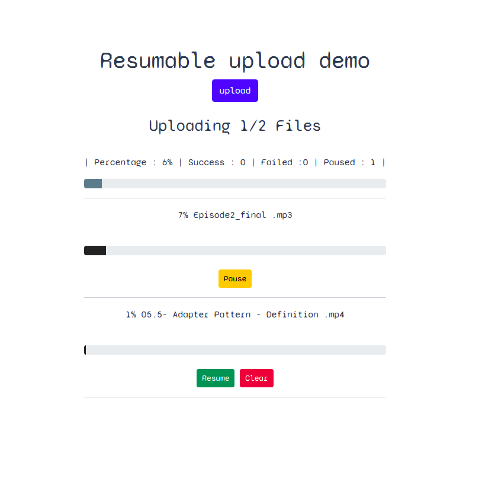

<p align="center">
  <h3 align="center">resumable uploading demo</h3>
  <p align="center"> resumable file uploading client using nodejs and XMLHttpRequest  </p>
</p>
<p align="center">
  
</p>


### Usage

1. Clone the repo
    ```sh
    git clone https://github.com/civilcoder55/resumable-uploading-demo.git
    ```

2. Install npm packages
    ```sh
    npm install
    ```

3. run server 
    ```sh
    npm start 
    ```

4. go to 
    ```sh 
    http://127.0.0.1:3000/ 
    ```

### Credits
i followed this tutorial and added some changed 
https://medium.com/before-semicolon/how-to-create-a-resumable-multifile-uploader-with-javascript-b077cece11c7